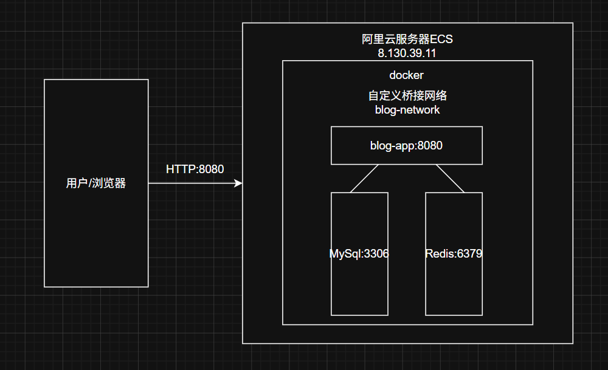
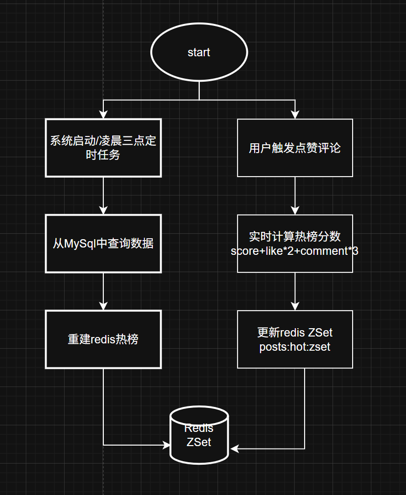
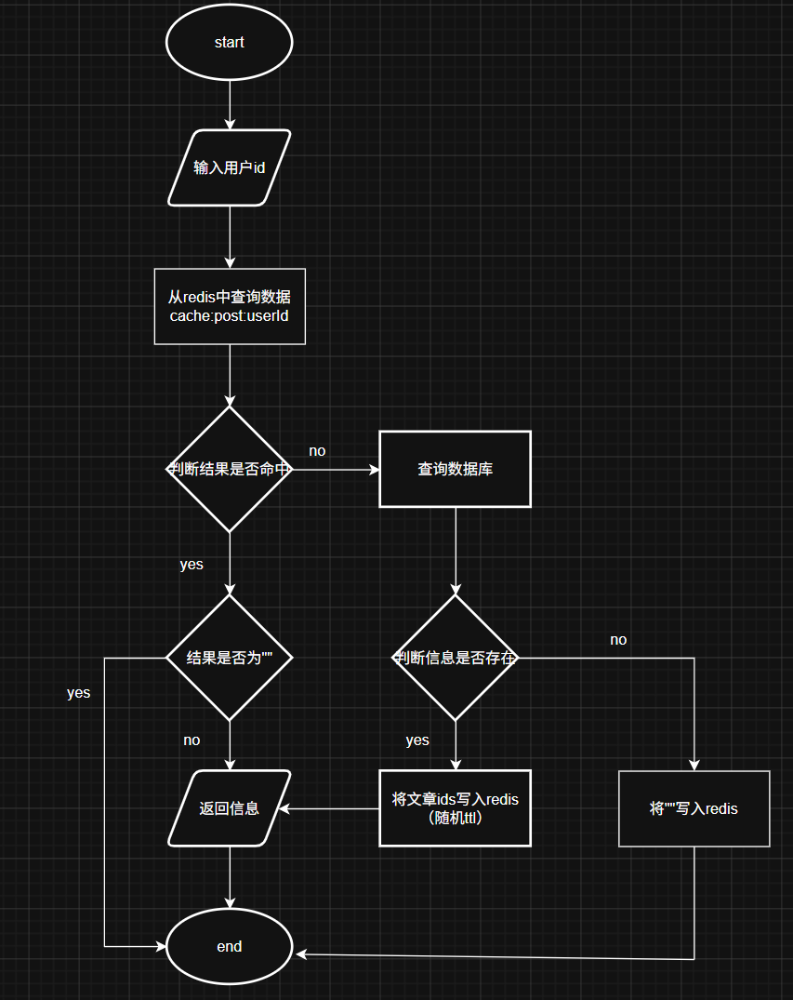

# PersonalBlog

一个基于 SpringBoot+redis 的高性能个人博客系统，重点实现  数据实时性、缓存一致性、热点计算与高吞吐计数


# 技术栈

| 组件                    | 版本           | 来源     |
| ----------------------- | -------------- | -------- |
| **Spring Boot**         | 3.3.0          | parent   |
| **Java**                | 17             |          |
| **MyBatis Spring Boot** | 3.0.3          | 显式指定 |
| **MySQL Connector**     | (由parent管理) | runtime  |
| **jjwt**                | 0.12.6         | 显式指定 |
| **Spring Data Redis**   | (由parent管理) |          |
| **Spring AOP**          | (由parent管理) |          |
| **Commons Lang3**       | (由parent管理) |          |
| **jbcrypt**             | 0.4            | 显式指定 |

# 核心功能

```
- 用户注册/登录（JWT 认证）
- 文章发布、编辑、分页搜索等
- 评论系统（支持多级回复）
- 点赞/取消点赞（Redis Set + 异步同步）
- 热门文章排行榜（ZSet + 定时计算）
- 个人中心（我的文章、我的评论）
```

# 项目亮点

### 高并发下的数据同步

为减少高并发场景下数据库写压力，点赞与评论数量先写入 Redis，再通过定时任务批量同步 MySQL，实现削峰与最终一致性。

### 基于Redis ZSet实现的热榜排序

基于 Redis ZSet 实现热门文章排行榜，通过点赞数、评论数与时间衰减因子综合计算热度分数，兼顾热点实时性与旧文章衰减问题。

热度公式：

```
(like_count*2+comment_count*3)/(pow(DATEDIFF(NOW(),create_time)+2,0.5))
```

定时凌晨3点刷新热榜（5min定时刷新点赞数和评论数量）

### 缓存优化

避免缓存穿透、缓存雪崩

实现缓存空值、随机 TTL 等策略，解决缓存穿透与缓存雪崩问题。

```java
public <R> R getWithPassThrough(String key, Long id, Class<R> type, Function<Long, R> dbFallback){

        //避免缓存穿透
        String strJson = stringRedisTemplate.opsForValue().get(key + id);
        //查询缓存
        if(StringUtils.isNotBlank(strJson)){
            try {
                //泛型擦除，需要传进来类型
                R r = objectMapper.readValue(strJson,type);

                return r;
            } catch (JsonProcessingException e) {
                throw new RuntimeException("缓存反序列化失败");
            }
        }
        //是否是空内容,命中的是""
        if(strJson!=null){
            return null;
        }
        //查询数据库
        R r = dbFallback.apply(id);
        //数据库没有，缓存空对象
        if(r==null){
            try {
                stringRedisTemplate.opsForValue().set(key+id,objectMapper.writeValueAsString(""));
                return null;
            } catch (JsonProcessingException e) {
                throw new RuntimeException("写入空值失败");
            }
        }
        //防止缓存雪崩并写入redis
        try {
            long ttl=10+ RandomUtils.nextInt(0,100);
            stringRedisTemplate.opsForValue().set(key+id, objectMapper.writeValueAsString(r),ttl, TimeUnit.MINUTES);
            return r;
        } catch (JsonProcessingException e) {
            throw new RuntimeException("缓存写入失败");
        }
    }
```


# Docker compose部署

项目采用 Docker Compose 进行容器化部署，
包含：

\- SpringBoot
\- MySQL
\- Redis

实现服务编排、容器网络互联与数据卷持久化。


拉取镜像

```
docker pull registry.cn-hangzhou.aliyuncs.com/wangliu_personal_blog/blog-project-blog:latest
```

启动方式

```bash
docker compose up -d --build
```

其中init.sql和docker-compose.yml我也上传了,clone的时候注意路径


# 系统架构图




# 流程图

## 热榜流程图



## 缓存穿透流程图

总共有四个地方用到了缓存穿透，这里以通过userId查询某个人写过的文章为例子



